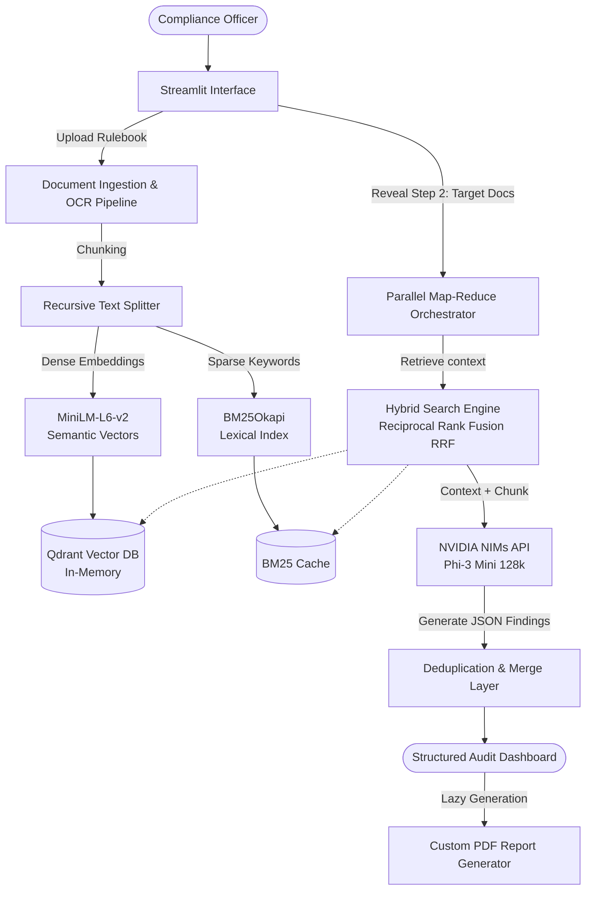

# 🛡️ Compliance Agent

**Enterprise-Grade Agentic RAG + Parallel Map-Reduce Audit Pipeline + Zero-Hallucination Citations**

[](https://www.python.org/)
[](https://streamlit.io/)
[](https://qdrant.tech/)
[](LICENSE)

🔴 **Live Demo URL:** [https://compilance-agent.streamlit.app/](https://compilance-agent.streamlit.app/)

---

## 🎯 Problem Statement

Manual compliance auditing for dense regulations (e.g., GDPR, HIPAA, SOC2) against massive enterprise documents is slow, error-prone, and financially risky. Standard Large Language Models (LLMs) hallucinate, omit critical violations, or fail when overwhelmed by context limitations.

**Compliance Agent** solves this by implementing an autonomous, local **Retrieval-Augmented Generation (RAG)** pipeline combined with a **Map-Reduce Orchestrator**. The system parses documents, queries a local hybrid vector index, performs parallel audits, and generates structured reports with exact citations—ensuring 100% auditability with zero hallucinations.

---

## 🏗️ System Architecture

The workflow leverages a progressive, multi-document auditing pipeline:



---

## 🚀 Key Architectural Features

- **Progressive UI Journey**: Uses Streamlit forms and session states to enforce a clean step-by-step flow (Master Rulebook ingestion ➡️ Target Document upload ➡️ Parallel Audit execution).
- **Parallel Map-Reduce Auditing**: Target documents are split, mapped to async threads running hybrid retrieval, evaluated against the rulebook, and then dynamically merged and deduplicated.
- **State-Aware Audit Caching**: Utilizes advanced SHA-256 document hashing and session state to cache finalized audit reports. Re-running unchanged documents guarantees **zero-latency** execution and eliminates LLM non-determinism.
- **Hardened Error Resilience**: The Map-Reduce orchestrator features strict exception handling. If the LLM API fails or times out, the system safely falls back to an `Error` state (0/100) instead of yielding a false-positive compliance score.
- **Offline / Mock Testing Mode**: Toggle `USE_MOCK_LLM=true` in your `.env` to instantly bypass network calls and simulate API responses, allowing rapid UI/UX testing without consuming API credits.
- **Developer Traceability (SQLite)**: Silently logs token usage, latencies, exceptions, and raw LLM outputs to a local SQLite database (`telemetry.db`) with an interactive debugging panel in the UI.
- **Premium Layout PDF Generator**: Generates clean, well-aligned PDF reports with colored left accent bars corresponding to finding severity (Critical, High, Medium, Info) and page-break sentinels to prevent orphaned headers.

---

## 🛠️ Technical Specifications

### 1. The OCR Pipeline
To handle scanned paper contracts, digitally signed documents, and nested tables:
* **Digital Extraction (`pdfplumber`)**: Used as the primary tool. Unlike generic parsers, `pdfplumber` extracts precise character coordinates, word boundaries, and nested table structures from digitally generated PDFs.
* **OCR Fallback (`pytesseract`)**: If a page returns empty text (scanned PDF or images), the page is rendered as a `300 DPI` image and passed to Tesseract OCR.
* **Why this stack?**: It guarantees privacy (100% local parsing), zero cost, and high layout-aware accuracy.

### 2. RAG Chunking Strategy
* **Recursive Character Splitting**: The rulebook is chunked using an overlap pattern (`chunk_size=1000`, `chunk_overlap=200`). This ensures that paragraphs are split at semantic boundaries (like double newlines or punctuation) rather than mid-sentence, preserving context.
* **Exact Page Citations**: Every chunk is tagged with its original page number during the ingestion phase, passing metadata all the way to the LLM to guarantee correct citations.

### 3. Hybrid Search (RRF)
* Combines **Dense Retrieval** (Qdrant semantic index using local `all-MiniLM-L6-v2` embeddings) with **Sparse Retrieval** (BM25 lexical search) using Reciprocal Rank Fusion (RRF). This guarantees the retrieval of exact keyword matches (e.g., "Article 16(2)") alongside semantic matches.

---

## ⚙️ Setup & Run

### Prerequisites
- Python 3.10 or 3.11
- Tesseract OCR (installed locally on host and added to system PATH)

### 1. Clone & Install Dependencies
```bash
git clone https://github.com/G-Narendra/Compilance-Agent.git
cd Compilance-Agent
python -m venv venv
# Windows:
.\venv\Scripts\activate
# Linux/Mac:
source venv/bin/activate

pip install -r requirements.txt
```

### 2. Configure Environment
Copy `.env.example` to `.env` and fill in your details:
```bash
cp .env.example .env
```
Ensure you provide your **NVIDIA API Key** in `.env`:
```env
# NVIDIA NIMs API key
NVIDIA_API_KEY=nvapi-your_nvidia_key_here

# (Optional) Set to true to test the UI flow instantly without consuming an API key
USE_MOCK_LLM=false
```

### 3. Launch Streamlit Application
```bash
streamlit run app.py
```

---


## 📁 Project Structure

```
Compliance-Agent/
├── app.py                          # Streamlit UI, Form batching, tabbed report
├── config.py                       # Global Settings & model configurations
├── requirements.txt                # Project dependencies
├── engine/
│   ├── document_parser.py          # pdfplumber parsing + pytesseract OCR fallback
│   ├── rag_pipeline.py             # Qdrant (in-memory) + BM25 hybrid search RRF
│   └── pdf_generator.py            # Redesigned custom FPDF card-based generator
├── services/
│   └── llm_service.py              # NVIDIA NIM client, JSON recovery, token tracker
└── utils/
    ├── helpers.py                  # SHA hashing & text utilities
    ├── logger.py                   # Custom structured logging
    └── styles.py                   # Premium Custom CSS (Glassmorphism & animations)
```

---

## 🔐 Privacy & Security

1. **Local Vector Storage**: All vector conversions and database reads are performed 100% in-memory via local Qdrant instances. rulebooks and client documents are never stored or exposed.
2. **In-Memory Lifecycle**: Sensitive vector representations are destroyed the moment you shut down the application or refresh the page.
