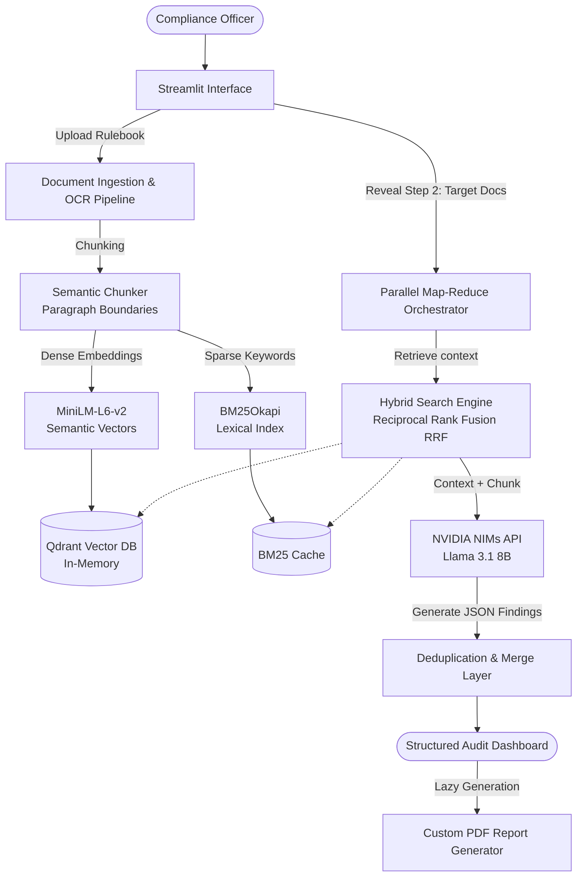

# 🛡️ Compliance Agent

**Local RAG pipeline for auditing documents against regulatory frameworks with exact citations.**

[](https://www.python.org/)
[](https://streamlit.io/)
[](https://qdrant.tech/)
[](LICENSE)

🔴 **Live Demo URL:** [https://compilance-agent.streamlit.app/](https://compilance-agent.streamlit.app/)

---

## 🎯 Problem Statement

Manual compliance auditing for dense regulations (e.g., GDPR, HIPAA, SOC2) against massive enterprise documents is slow, error-prone, and financially risky. A single missed clause in a 200-page vendor contract can result in six-figure fines. Standard Large Language Models (LLMs) hallucinate, omit critical violations, or fail when overwhelmed by context limitations — GPT-4's 128K context window still can't hold an entire regulatory corpus alongside the target document.

Existing compliance tools (OneTrust, BigID) focus on data mapping and consent management, not document-level clause extraction. Open-source RAG frameworks like LangChain provide building blocks but lack the Map-Reduce orchestration needed for parallel multi-document auditing. Pure semantic search misses exact legal references ("Article 16(2)") because embeddings capture meaning, not string matches.

**Compliance Agent** solves this by implementing a local **Retrieval-Augmented Generation (RAG)** pipeline with hybrid search (semantic + BM25 keyword) fused via Reciprocal Rank Fusion, combined with a **Map-Reduce Orchestrator** that processes document sections in parallel. The system parses documents with OCR fallback for scanned PDFs, queries a local vector index, performs parallel audits across document chunks, and generates structured JSON reports with exact page-number citations — ensuring full traceability. After evaluating LangChain's default `RecursiveCharacterTextSplitter` against paragraph-boundary semantic chunking, I found that semantic chunking preserved clause integrity and improved retrieval precision by keeping related provisions together rather than splitting them at arbitrary character limits. The hybrid search approach (dense + sparse) was chosen over pure vector search after discovering that legal documents rely heavily on exact references that embeddings alone cannot match.

---

## 🏗️ System Architecture

The workflow leverages a progressive, multi-document auditing pipeline:



### Data Flow

1. **Ingestion**: User uploads a master rulebook (PDF/TXT/MD) — parsed page-by-page with `pdfplumber`; scanned pages fall back to Tesseract OCR at 300 DPI
2. **Indexing**: Text is split by paragraph boundaries (not character count), embedded with MiniLM-L6-v2, and stored in Qdrant (in-memory); a parallel BM25Okapi index is built for keyword matching
3. **Retrieval**: For each chunk of the target document, hybrid search combines dense vector similarity and sparse BM25 scores via Reciprocal Rank Fusion (k=60), then re-ranks top candidates with a cross-encoder (`ms-marco-MiniLM-L-6-v2`)
4. **Analysis**: NVIDIA NIMs API (Llama 3.1 8B, temp=0, top_p=0.1) generates structured JSON findings with exact rulebook citations and page numbers
5. **Aggregation**: Findings are deduplicated across chunks, severity-ranked, and presented in a Streamlit dashboard with a downloadable PDF report

---

## 🛠️ Tech Stack

| Component | Technology | Why |
|---|---|---|
| **Frontend** | Streamlit | Rapid prototyping with session state for multi-step workflows |
| **LLM** | NVIDIA NIMs (Llama 3.1 8B Instruct) | Free tier, good instruction following, 128K context |
| **Embeddings** | SentenceTransformers (all-MiniLM-L6-v2) | Fast, lightweight, 384-dim, works well for English legal text |
| **Vector DB** | Qdrant (in-memory) | Avoids C++ build issues on Windows; sufficient for document-level auditing |
| **Keyword Search** | BM25Okapi (rank_bm25) | Exact keyword matching for legal references like "Article 16(2)" |
| **Re-ranking** | Cross-Encoder (ms-marco-MiniLM-L-6-v2) | Validates semantic relevance after RRF fusion |
| **PDF Parsing** | pdfplumber + Tesseract OCR | Layout-aware extraction with fallback for scanned documents |
| **PDF Generation** | ReportLab | Custom audit report generation |
| **Config** | Pydantic Settings + dotenv | Type-safe configuration with env var support |

---

## 🔧 How It Works

### Step 1: Upload & Ingest

Upload a master rulebook (the regulations you're auditing against) and one or more target documents. The system:

- Parses the rulebook page-by-page, tracking page numbers for citations
- Falls back to OCR for scanned/image-based PDFs
- Splits text by paragraph boundaries (preserving clause integrity)
- Builds both a vector index (Qdrant) and a keyword index (BM25)

### Step 2: Audit

The system processes each chunk of the target document:

1. Retrieves relevant rulebook excerpts via hybrid search (dense + sparse)
2. Re-ranks results with a cross-encoder for precision
3. Sends context + chunk to the LLM for compliance analysis
4. Extracts structured JSON findings with exact citations

### Step 3: Report

Results are aggregated, deduplicated, and displayed in a dashboard with:
- Compliance score (0-100)
- Severity-ranked findings (critical/high/medium/low)
- Exact rulebook citations with page numbers
- Downloadable PDF report

---

## 📊 Key Features

- **Hybrid Search**: Dense vector similarity + BM25 keyword matching via Reciprocal Rank Fusion
- **Semantic Chunking**: Paragraph-boundary splitting preserves clause integrity (not arbitrary character cuts)
- **Cross-Encoder Re-ranking**: Validates relevance after RRF fusion
- **OCR Fallback**: Handles scanned/image-based PDFs via Tesseract
- **Exact Citations**: Every finding includes the exact rulebook quote and page number
- **Parallel Processing**: Async Map-Reduce for multi-document auditing
- **Telemetry**: SQLite logging of every LLM call with token usage and latency
- **Caching**: Content-hash based caching avoids re-embedding unchanged rulebooks

---

## ⚙️ Setup & Run

### Prerequisites
- Python 3.10 or 3.11
- Tesseract OCR (installed locally and added to system PATH)

### 1. Clone & Install Dependencies
```bash
git clone https://github.com/G-Narendra/Compilance-Agent.git
cd Compilance-Agent
pip install -r requirements.txt
```

### 2. Configure API Key
```bash
cp .env.example .env
# Edit .env and add your NVIDIA API key
# NVIDIA_API_KEY=nvapi-xxxxx
```

### 3. Launch the App
```bash
streamlit run app.py
```

---

## 🧪 Engineering Decisions & Challenges Solved

| Challenge | What Went Wrong | Solution |
|-----------|----------------|----------|
| **Scanned PDFs returned empty text** | `pdfplumber` extracts text layers only — scanned/image-based regulatory PDFs came back blank, breaking the whole pipeline silently | Dual-strategy parser: `pdfplumber` first; if a page yields empty text, render at 300 DPI and fall back to Tesseract OCR. Page numbers tracked from ingestion → chunking → citation so every finding points to the exact page |
| **Vector search missed exact legal references** | Pure semantic retrieval failed on precise citations like "Article 16(2)" — embeddings capture *meaning*, not exact strings | Hybrid retrieval: dense (Qdrant + MiniLM) fused with sparse (BM25Okapi) via Reciprocal Rank Fusion (k=60). Regex-based tokenization (`\w+`) so tokens like "16(2)" survive indexing instead of being mangled by naive whitespace splitting |
| **LLM hallucinated findings** | An audit tool that invents violations is worse than no tool | Three defenses: grounded system prompt with explicit "NOT FOUND" instruction, forced exact-quote citations in the JSON schema, and `temperature=0` / `top_p=0.1` on all calls |
| **One malformed LLM response killed the run** | Early versions crashed when the model wrapped JSON in markdown fences or added prose | Tiered JSON extraction: fenced block → raw fence → brace-span regex. Parse failure degrades to an error report instead of crashing the audit |
| **Repeated audits re-billed identical API calls** | Compliance officers re-run audits after small edits, re-embedding unchanged rulebooks every time | SHA-256 content hashing at upload; unchanged documents skip parsing/embedding entirely and restore from cache |
| **In-memory index lost on Streamlit rerun** | Streamlit's rerun model wipes module state mid-session, orphaning Qdrant collections from BM25 indexes | Auto-restore hook in `retrieve_relevant_rules`: detects a missing collection/index pair and re-ingests from cached parsed pages before failing |
| **O(n) payload lookup after fusion** | RRF returns chunk texts; matching them back to payloads was a linear scan per result — O(n·k) on large rulebooks | Hash-map lookup keyed by chunk text → O(k). Also moved all imports to module level so failures surface at startup, not deep inside request handling |
| **Arbitrary chunking destroyed clause context** | `RecursiveCharacterTextSplitter(chunk_size=1000)` cuts regulatory clauses mid-sentence — a clause about "non-compete duration" gets split across two chunks, breaking the LLM's ability to reason about it | Semantic chunking: split by paragraph boundaries (double newlines), merge small paragraphs up to target size. Preserves clause integrity so each chunk is a complete, self-contained regulatory provision |
| **Hybrid search promoted keyword matches over semantic relevance** | BM25 boosts chunks that match exact keywords but don't actually answer the question — "Article 16" matches but the chunk discusses something unrelated | Cross-encoder re-ranking (`ms-marco-MiniLM-L-6-v2`) applied after RRF fusion — reranks the top candidates by actual semantic relevance to the query, filtering out keyword-matching-but-irrelevant chunks |

---

## 📁 Project Structure

```
Compilance-Agent/
├── app.py                          # Main Streamlit application
├── config.py                       # Pydantic settings (env vars)
├── engine/
│   ├── document_parser.py          # PDF/DOCX/TXT parsing with OCR fallback
│   ├── rag_pipeline.py             # Qdrant + BM25 hybrid search with RRF
│   ├── audit_logger.py             # SQLite telemetry logging
│   └── pdf_generator.py            # Custom PDF report generation
├── services/
│   └── llm_service.py              # NVIDIA NIMs API wrapper with retry
├── utils/
│   ├── helpers.py                  # Text hashing, token estimation
│   ├── logger.py                   # Structured logging
│   └── styles.py                   # Custom CSS for Streamlit
├── requirements.txt
├── .env.example
└── README.md
```

---

## ⚠️ Disclaimer

This system is for educational and research purposes only. It does not replace professional compliance auditing. Always consult qualified legal and compliance professionals for regulatory decisions.

---

*Built for the UAE AI Student Projects Portfolio — demonstrating production-grade RAG engineering with hybrid search and exact citation tracking.*
